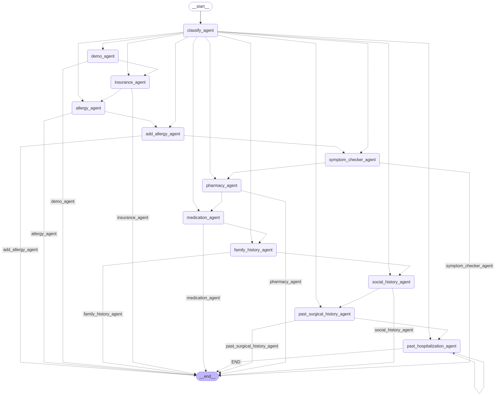

# 🎙️ AI-Powered Voice-to-Voice Patient Check-in System



## 📋 Overview

The AI-Powered Voice-to-Voice Patient Check-in System is an innovative healthcare solution that automates and streamlines the patient intake process. This intelligent system uses advanced natural language processing and a multi-agent architecture to collect comprehensive patient information through natural voice conversations, eliminating paperwork and reducing administrative burden in healthcare settings.

The system features a sophisticated voice-based interface that allows patients to simply speak their responses, making it accessible for all users regardless of their technological proficiency or physical limitations.

## 🌟 Key Features

- **Voice-to-Voice Interaction**: Natural conversation flow with speech recognition and text-to-speech capabilities
- **Multi-Agent Architecture**: Specialized AI agents handling different aspects of patient intake
- **Agentic Workflow**: Intelligent routing between agents based on context and patient responses
- **LangChain & LanGraph Integration**: Advanced language model orchestration for coherent conversations
- **Comprehensive Data Collection**: Gathers complete patient information across multiple healthcare domains
- **Mobile Application**: User-friendly interface designed for ease of use

## 🤖 Agent System Architecture

The system employs a network of specialized agents, each responsible for gathering specific categories of patient information:

- **Classification Agent**: Determines which specialized agent to route to based on context
- **Demographics Agent**: Collects basic patient information (name, DOB, contact details)
- **Insurance Agent**: Gathers insurance provider details and policy information
- **Allergy Agent**: Records patient allergies to medications, foods, and environmental factors
- **Symptom Checker Agent**: Assesses current symptoms and chief complaints
- **Medication Agent**: Documents current medications and dosages
- **Family History Agent**: Collects information about relevant family medical history
- **Social History Agent**: Gathers lifestyle information (smoking, alcohol use, etc.)
- **Past Surgical History Agent**: Records previous surgeries and procedures
- **Post Hospitalization Agent**: Follows up on recent hospital stays
- **Pharmacy Agent**: Manages prescription information and preferred pharmacies

## 🛠️ Technology Stack

- **Backend**: Python
- **AI Framework**: LangChain, LanGraph
- **Large Language Models**: Integration with state-of-the-art LLMs
- **Web Framework**: Django
- **Speech Processing**: Advanced STT (Speech-to-Text) and TTS (Text-to-Speech) systems
- **Containerization**: Docker
- **Deployment**: Gunicorn

## 🚀 Installation & Setup

### Prerequisites
- Python 3.8+
- Docker (optional for containerized deployment)
- API keys for your preferred LLM provider

### Local Setup

1. **Clone the repository**
   ```bash
   git clone https://github.com/MANEEQ786/Ai_Powered_Voice2Voice_Chatbot.git
   cd Ai_Powered_Voice2Voice_Chatbot
   ```

2. **Create a virtual environment**
   ```bash
   python -m venv venv
   source venv/bin/activate  # On Windows: venv\Scripts\activate
   ```

3. **Install dependencies**
   ```bash
   pip install -r requirements.txt
   ```

4. **Environment setup**
   - Create a `.env` file with your API keys and configuration:
   ```
   LLM_API_KEY=your_llm_api_key
   OTHER_CONFIG_VALUES=values
   ```

5. **Run migrations**
   ```bash
   python manage.py migrate
   ```

6. **Start the development server**
   ```bash
   python manage.py runserver
   ```

### Docker Deployment

1. **Build the Docker image**
   ```bash
   docker build -t ai-voice-chatbot .
   ```

2. **Run the container**
   ```bash
   docker run -p 8000:8000 -d ai-voice-chatbot
   ```

## 📱 Usage

1. **Access the web interface** at `http://localhost:8000` (or your deployed URL)
2. **Grant microphone permissions** when prompted
3. **Start the conversation** by clicking the microphone button
4. **Speak naturally** to answer questions as the system guides you through the check-in process
5. **Review the collected information** at the end of the session

## 🎬 Demo

[](https://www.youtube.com/watch?v=YOUR_VIDEO_ID)

*Click the image above to watch a demonstration of the AI Voice Chatbot in action. Replace YOUR_VIDEO_ID with your actual YouTube video ID.*

## 📊 System Workflow

The system follows an intelligent workflow where each agent handles a specific domain of patient information:

1. The **Classification Agent** begins the conversation and determines which specialized agent to invoke
2. Specialized agents (Demographics, Insurance, Allergy, etc.) are activated based on context
3. Each agent collects relevant information through natural voice conversation
4. The system intelligently transitions between agents to create a cohesive experience
5. All collected data is structured and stored for healthcare provider use

## 🧠 Technical Architecture

The project uses LangChain and LanGraph to orchestrate the complex interactions between multiple specialized agents. This architecture allows for:

- **Dynamic agent selection** based on conversation context
- **Knowledge sharing** between agents
- **Contextual memory** throughout the conversation
- **Fallback mechanisms** for handling unexpected inputs
- **Seamless transitions** between different information domains

## 🔄 Data Flow

1. **Voice Input** → Speech-to-Text processing
2. **Text Analysis** → Intent recognition and context assessment
3. **Agent Selection** → Routing to appropriate specialized agent
4. **Information Extraction** → Structured data collection by the agent
5. **Response Generation** → Formulating appropriate follow-up questions
6. **Text-to-Speech** → Converting response to natural voice output
7. **Data Storage** → Securely storing collected information

## 🤝 Contributing

Contributions to improve the AI Voice Chatbot are welcome! Please follow these steps:

1. Fork the repository
2. Create a feature branch (`git checkout -b feature/amazing-feature`)
3. Make your changes
4. Commit your changes (`git commit -m 'Add some amazing feature'`)
5. Push to the branch (`git push origin feature/amazing-feature`)
6. Open a Pull Request


## 📞 Contact

Project Creator: MUHAMMAD ANEEQ (https://github.com/MANEEQ786)

## 🙏 Acknowledgments

- LangChain community for their excellent tools and documentation
- Healthcare professionals who provided domain expertise
- All contributors who helped shape this project
